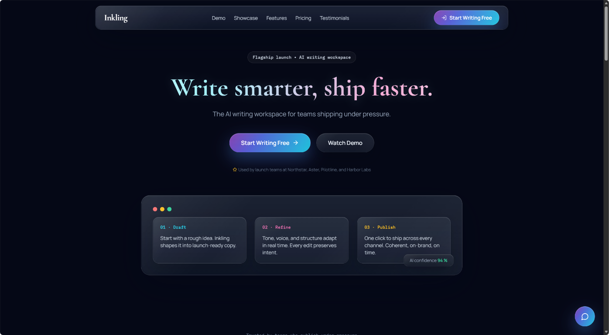
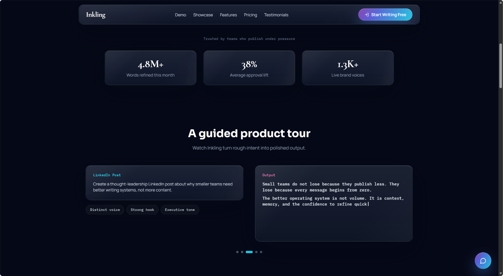
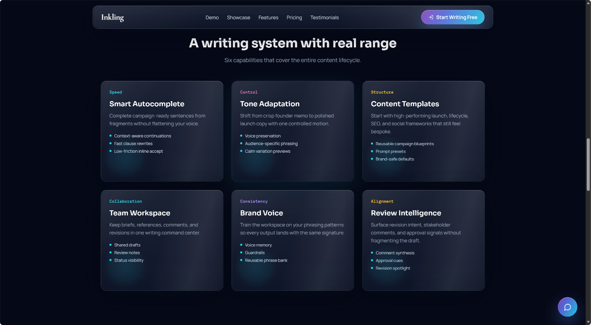
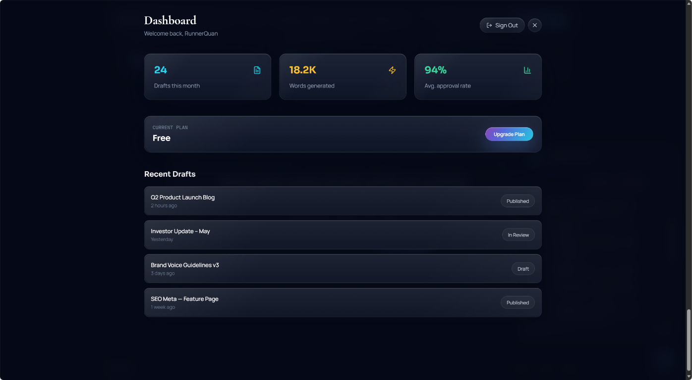
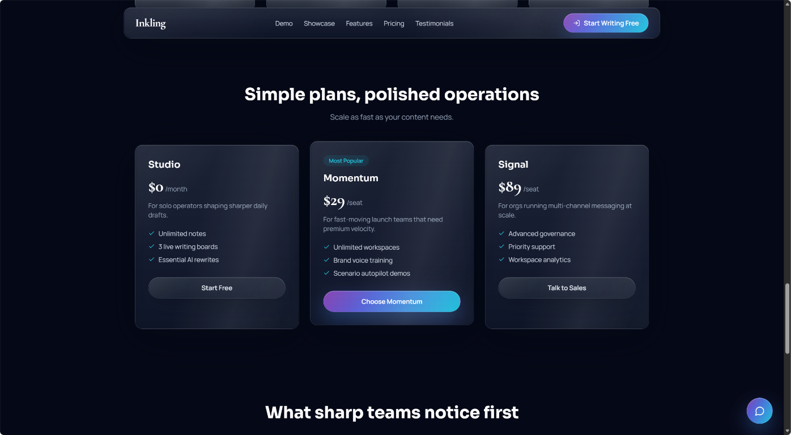
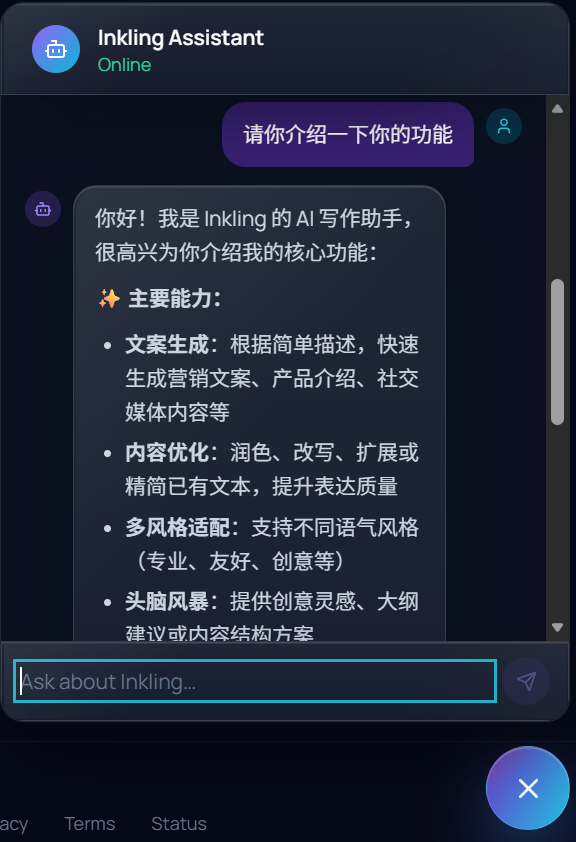

# ai-writing-assistant-saas-skill

`ai-writing-assistant-saas-skill` 是一个用于生成 **Inkling** 的 Skill：它可一键产出可部署到 **EdgeOne Pages** 的 AI 写作 SaaS 全栈项目模板（前端 + Edge Functions + KV + Node Functions）。

## 能力概览

- 生成完整项目骨架（React + Vite + TypeScript + Tailwind + Framer Motion）
- 提供 Edge Functions API（内容、waitlist、分享、认证、支付、AI chat）
- 内置 KV 持久化键约定（waitlist / share / user / session / chat / subscription）
- 提供部署脚本、参考文档与可直接复制的模板工程

## 仓库结构

```text
.
├── SKILL.md                 # Skill 主定义与执行流程
├── references/              # API / 设计系统 / 架构参考文档
├── scripts/                 # 部署辅助脚本
└── templates/project/       # 可生成的完整项目模板
```

## 快速使用

1. 在支持 Skill 的环境中加载本 Skill。
2. 按 `SKILL.md` 的提问流程提供业务信息（产品名、标语、功能范围、部署区域等）。
3. 基于 `templates/project/` 生成项目后，在项目目录执行：
   - `npm install`
   - `npm run dev`（本地开发）
   - `npm run build`（构建）
4. 部署到 EdgeOne Pages（可用 `scripts/deploy.sh` 或 `edgeone pages deploy`）。

## AI Chat 必配环境变量（重要）

`/api/chat` 需要显式配置模型密钥，否则会返回 `AI_NOT_CONFIGURED`。

1. 设置 `AI_API_KEY`（必需）
2. 设置 `AI_MODEL`（必需）
3. 按需设置 `AI_API_URL`（可选，默认 OpenAI-compatible chat completions 地址）
4. 重新部署
5. 调用 `/api/chat` 验证返回 `ok: true` 且 `reply` 非空

## 网页展示（Screenshots）

### 1. 首页 Hero


### 2. Product Tour


### 3. Features


### 4. Dashboard


### 5. Pricing


### 6. Chat Widget


## 参考文档

- `references/api-reference.md`
- `references/design-system.md`
- `references/edge-functions.md`
- `references/project-structure.md`

## License

如无额外声明，默认仅用于学习与项目内部参考；如需开源分发，请补充你的许可证文件（如 MIT `LICENSE`）。
